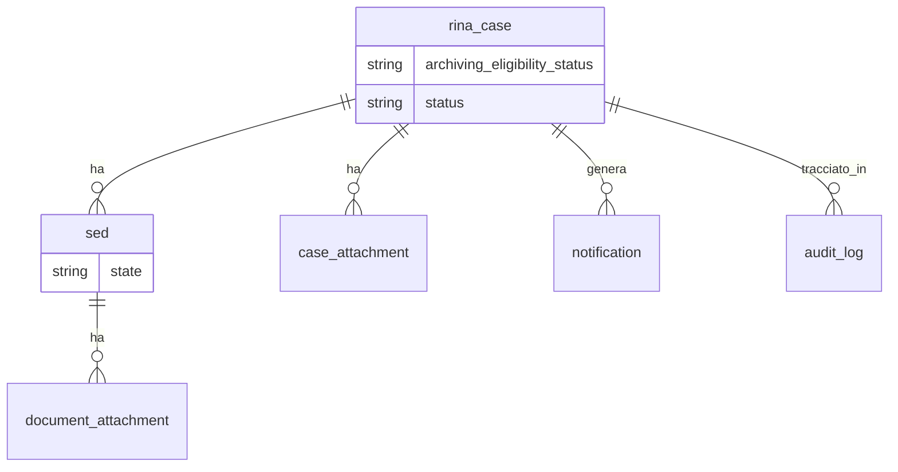

# JINA RN:12284226 — Extra CR: SED Message Archiving (Functional Analysis) v1.0

**TECHNICAL RELATION** | CIG 9623953142 | RN:12284226 — Extra CR - SED Message Archiving (Functional Analysis)

*Copertina del documento — logo/intestazione Engineering Ingegneria Informatica / TGC.*

> ⚠️ *Nota: un elemento grafico vettoriale (EMF) presente nella copertina originale non è stato convertito per limitazioni di formato.*

*Logo e grafica istituzionale della copertina (Engineering / EESSI / JINA).*

**TGC Engineering Ingegneria Informatica**

RN:12284226_Extra CR-SED_Message_Archiving (Functional Analysis)

CIG 9623953142

| Column 1 | Column 2 | Column 3 |
| --- | --- | --- |
| Date: 0x Dicembre 2025 |  | Doc. Version: 1.0 |

## Document Control Information

| Settings | Value |
| --- | --- |
| Document Title: | RN12284226_Extra CR-SED_Message_Archiving_V1.0 (Functional Analysis) |
| Project Id: | CIG 9623953142 |
| Document Authors: |  |
| Project Owner: | Barbara Ingrosso (PO) |
| Project Manager: | Milko Anselmi (PM) |
| Doc. Version: | 1.0 |
| Sensitivity: | Reserved |
| Date: | 0x Dicembre 2025 |

| Name | Role | Action | Date |
| --- | --- | --- | --- |
|  |  | &lt;Approve / Review&gt; |  |

| Revision | Date | Created by | Short Description of Changes |
| --- | --- | --- | --- |

---

## Sommario

1. Introduction
   - 1.1 General Overview
   - 1.2 Scope
   - 1.3 Glossary of Terms
   - 1.4 CR Overview
2. AS-IS
3. TO-BE
   - 3.1 Processo di Archiviazione — Back End
   - 3.2 Processo di Archiviazione — Front End
   - 3.3 Backup e Data Retention
   - 3.4 Architettura Tecnica
   - 3.5 Riepilogo delle Modifiche
4. Casi d'uso
5. References and Related Documents

---

## 1. Introduction

### 1.1 General Overview

The Join Implementation of a National Applications (JINA) is a web-based software application for the electronic management and exchange of social security cases across competent institutions of the participant countries. Currently managed by Jump-RINA to ensure the evolution of the EESSI project (Electronic Exchange of Social Security Information).

### 1.2 Scope

Il presente documento ha natura dinamica ed è soggetto ad aggiornamenti e approfondimenti durante tutto il ciclo di vita del progetto. I contenuti riportati nel documento descrivono il comportamento attuale (AS-IS) e le indicazioni funzionali sul comportamento futuro (TO-BE) secondo quanto richiesto dalla CR 12284226.

### 1.3 Glossary of Terms

| Term/Acronym | Definition |
| --- | --- |
| RINA | Reference Implementation of National Applications |
| CDM | Common Data Model |
| CR | Change request |
| SBDH | Standard Business Document Header |
| SED | Structure Electronic Document |
| BUC | Business Use Case |
| CO | Case Owner |
| CP | Counterparty |

### 1.4 CR Overview

- **CR number**: RN:12284226
- **Title**: Extra CR-SED_Message_Archiving
- **Slot**: da definire
- **Elementi impattati**: Archiving e Backup

---

## 2. AS-IS

Attualmente, tutti i dati relativi ai Case, ai documenti SED ed altri dati correlati, sono archiviati nel database operativo PostgreSQL senza meccanismi di archiviazione strutturati.

I dati relativi a: case, documenti SED (e relative versioni), allegati, notifiche, rimangono archiviati permanentemente nel database operativo, indipendentemente dal loro stato di vita.

L'attuale funzionalità di archiviazione presente su JINA si limita a:

- impostare lo stato del caso, sul DB, in "Archived"
- non rimuove o sposta fisicamente i dati dal database
- mantiene i dati dei casi archiviati nel database operativo

Di conseguenza:

- il volume dei dati aumenta continuamente nel tempo;
- le prestazioni delle query PostgreSQL si degradano, soprattutto per il recupero ed il filtraggio dei casi;
- le prestazioni delle query Elasticsearch risentono delle grandi dimensioni degli indici;
- i costi di archiviazione dell'infrastruttura aumentano significativamente.

Non esistono politiche standardizzate di archiviazione e retention dei dati tra i paesi partecipanti, il che porta a pratiche di gestione dei dati incoerenti.

**Attualmente, la funzione di archiviazione di JINA genera i seguenti effetti:**

- Sul file system vengono spostati una grande quantità di casi chiusi;
- I case archiviati, presenti nella tabella `rina_case` del DB di JINA, modificano il loro stato in "Archived";
- I case in stato "Archived" rimangono definitivamente sul database.

*Screenshot AS-IS — Vista del database/interfaccia JINA che mostra i casi in stato "Archived" presenti nel database operativo (tabella rina_case). Evidenzia la mancanza di separazione tra dati operativi e archiviati.*

*Screenshot AS-IS — Ulteriore dettaglio dello stato di archiviazione attuale: i dati rimangono nel DB operativo senza spostamento fisico, contribuendo alla crescita continua del volume dati.*

*Screenshot AS-IS — Vista delle performance o dello stato del sistema con dati cumulati non archiviati, a evidenziare l'impatto sul DB operativo PostgreSQL ed Elasticsearch.*

---

## 3. TO-BE

L'obiettivo principale di questa change request è implementare una soluzione dedicata, per i case del sistema JINA, che includa:

- **Archiviazione** strutturata
- **Backup** dei dati
- **Gestione del ciclo di vita dei dati**

### 3.1 Processo di Archiviazione — Back End

La soluzione deve prevedere:

- Separazione tra dati operativi e dati archiviati
- Retention configurabile
- Storage esterno dedicato

**Il sistema deve:**

- identificare i case archiviabili in modo *business-aware*, validando l'integrità dei dati e la coerenza referenziale, senza basarsi unicamente sullo stato Closed / Archived (*vedi Vincoli Funzionali*);
- estrarre la struttura completa del caso (caso + SED + allegati + notifiche);
- migrare l'intero grafo dati del case verso un Archive DB dedicato, con spostamento dei payload pesanti verso external storage;
- eliminare i dati archiviati dal database operativo solo dopo conferma di archiviazione riuscita;
- consentire la de-archiviazione applicativa, reimportando i dati nel sistema JINA, anche lato FE.

Un caso archiviato (a meno che non sia stato eliminato) dovrà essere ancora disponibile tramite la Ricerca casi (cerca i casi "archiviati" o direttamente utilizzando il numero del caso con la funzione di ricerca testuale). Il caso dovrà poter essere ripristinato selezionando "Ripristina" dalla visualizzazione dei risultati della ricerca.

**Introdurre una strategia di backup e disaster recovery** del DB operativo, DB archivio e contenuti esterni, comprendente meccanismi di versioning e ripristino.

Le regole di conservazione dei dati dovranno essere configurabili e potranno variare in base a: Paese, tipologia di dati, vincoli normativi (es. GDPR).

Vincoli Funzionali

Il processo di archiviazione non deve essere applicato indistintamente a tutti i casi basandosi esclusivamente sullo stato "Closed"; anche perché alcuni casi sono ancora operativi dal punto di vista aziendale, anche se chiusi localmente. In particolare:

- alcuni BUC consentono la chiusura locale senza completamento globale;
- i case possono rimanere "vivi" lato business;
- gli utenti potrebbero ancora aver bisogno di accedere ai dati dei casi chiusi per scopi operativi o di consultazione;
- i casi archiviati prematuramente possono avere un impatto negativo sulle operazioni degli utenti.

**Un case è archiviabile solo se:**

- lo stato globale del BUC è completato;
- nessun SED è in stato Draft/Processing;
- non è presente alcuna azione utente ancora pendente;
- è superato il periodo configurato di retention;
- non è marcato come "case sensibile" o "in consultazione".

Dimensioni di Valutazione

| Dimensione | Descrizione |
| --- | --- |
| Stato globale BUC | completato / non completato |
| Stato SED | tutti inviati/completati |
| Attività utente | nessuna azione richiesta |
| Tempo | retention configurata |
| Flag business | case consultabile |

Matrice Decisionale

**Case archiviabile:**

| Condizione | Valore |
| --- | --- |
| BUC completato | SI |
| SED completati | SI |
| Draft presenti | NO |
| Azioni pendenti | NO |
| Retention superata | SI |

**Case non archiviabile:**

| Scenario | Motivo |
| --- | --- |
| Chiusura locale BUC | business ancora attivo |
| SED mancanti | processo non completo |
| Draft presenti | attività utente |
| Caso consultazione | necessità operativa |
| Caso recente | retention non soddisfatta |

> **Regola fondamentale**: L'archiviazione è un processo *business-aware* e NON puramente tecnico.

Configurabilità

Le policy devono essere configurabili per: Paese, BUC, Ruolo (CO vs CP), Tipo case.

**Introduzione nuovo campo**: `case.archiving_eligibility_status` con i valori:\
`NOT_ELIGIBLE` | `ELIGIBLE` | `IN_PROGRESS` | `ARCHIVED` | `FAILED` | `RESTORED`

Permette: controllo totale del processo, logging chiaro, tracciabilità.

DATABASE

A livello di database dovranno essere identificate:

- Le tabelle coinvolte nell'archiviazione e nel backup (comprese `document_attachment`, `case_attachment`, `notifications`);
- Le relazioni tra di esse;
- I foreign key da ricreare in archive DB;
- Il corretto ordine di migrazione: `rina_case → sed → document_attachment → case_attachment → notification → audit_log`.

**Dovranno essere implementati:**

- DB archivio con schema identico
- DB link tra DB operativo e archivio
- Script: INSERT (archiviazione), DELETE (pulizia), Gestione errori (rollback parziale)

**Entità coinvolte:**

| Entità | Descrizione |
| --- | --- |
| rina_case | Tabella principale dei casi |
| sed / structured_document | Documenti SED |
| document_attachment | Allegati a livello SED |
| case_attachment | Allegati a livello case |
| notification | Notifiche |
| audit_log | Tracciamento eventi |

**Relazioni logiche tra le entità:**

*Diagramma delle relazioni logiche tra le entità del database JINA coinvolte nel processo di archiviazione.*

> Le entità sono fortemente relazionate: non è possibile archiviare parzialmente il dato → serve migrazione atomica del case.

**Strategia di archiviazione:**

| Tipo dato | Destinazione |
| --- | --- |
| Case / metadata | Archive DB |
| SED references | Archive DB |
| Allegati | File system / Object storage |
| SED XML | External storage |

### 3.2 Processo di Archiviazione — Front End

- Dovrà essere messa a disposizione una pagina di ricerca dei case archiviati;
- Dovrà essere messa a disposizione una funzione di de-archiviazione dei casi archiviati;
- Visualizzazione metadata.

> **Nota**: la configurazione non è applicabile indistintamente per alcuni BUC che prevedono chiusura locale senza completamento globale. Se tali casi venissero archiviati e non più visibili all'utente prima della chiusura effettiva, il caso non sarebbe più lavorabile. Potrebbe essere utile all'utente rivedere un caso per recuperare informazioni storiche.

### 3.3 Backup e Data Retention

**BACKUP** — Devono essere previsti:

- backup DB operativo
- backup DB archivio
- versioning dati
- recovery selettiva

**RETENTION** — Configurabile per: Paese, BUC, tipologia dati.

Esempi:

- 1 anno → consultazione
- 5 anni → retention legale
- oltre → cancellazione

### 3.4 Architettura Tecnica

**Riepilogo dei componenti:**

| Componente | Descrizione |
| --- | --- |
| **A. Operational DB** (PostgreSQL esistente) | Contiene i case attivi, i case recenti non ancora archiviati e tutte le transazioni operative. |
| **B. Archive DB** (nuovo PostgreSQL) | Contiene i metadati e le relazioni dei case archiviati. |
| **C. External Storage** | Contiene allegati, contenuti SED XML/ZIP e versioni storiche pesanti. |
| **D. Archiving Service** (nuovo componente) | Valuta l'eleggibilità, orchestra la copia in Archive DB, trasferisce payload allo storage esterno, valida, cancella dal DB operativo, registra log e stati. |
| **E. Restore Service** (nuovo componente) | Gestisce la de-archiviazione, recuperando metadati dal DB archivio e payload dallo storage esterno, per reinserirli nel DB operativo. |
| **F. Search Archive Index** (Elasticsearch dedicato) | Componente opzionale ma fortemente consigliata per supportare la ricerca dei case archiviati senza gravare sugli indici operativi. |

### 3.5 Riepilogo delle Modifiche

> *\[Da completare con elenco modifiche da richiedere agli sviluppatori\]*

---

## 4. Casi d'Uso

**Caso d'uso: Miglioramento della gestione dei dati per il sistema RINA/JINA**

Scenario: Il sistema RINA/JINA implementerà componenti dedicati per l'archiviazione e il backup, consentendo una gestione efficiente dei dati e una riduzione dei costi infrastrutturali.

**Caso d'uso: Archiviazione di un case — Ipotesi 1**

1. Identificazione dei case archiviabili
2. L'utente archivia il case
3. Lo stato del case viene modificato in "Archived" sul database di JINA
4. Il sistema di archiviazione sposta il case archiviato sul database secondario

**Caso d'uso: Archiviazione di un case — Ipotesi 2**

1. Identificazione case archiviabili
2. Validazione integrità
3. Estrazione dati (case + SED + allegati + notifiche)
4. Migrazione verso Archive DB
5. Cancellazione dal DB operativo
6. Logging operazione

**Caso d'uso: De-archiviazione di un case**

1. Ricerca case archiviato
2. Recupero dati da Archive DB + storage
3. Re-inserimento nel DB operativo
4. Ripristino stato e relazioni

**Eccezioni critiche:**

🔴 **Scenario 1 – BUC con chiusura locale**: caso chiuso lato user ma non completato globalmente → NON archiviabile

🔴 **Scenario 2 – Case usato per consultazione**: recupero info storiche → archiviazione ritardata

🔴 **Scenario 3 – Case con anomalie**: inconsistenza dati → blocco archiviazione

---

## 5. References and Related Documents

| \# | Reference or Related Document | Source or Link/Location |
| --- | --- | --- |
| 1 | TITOLO JIRA | EESSI-7724 |
