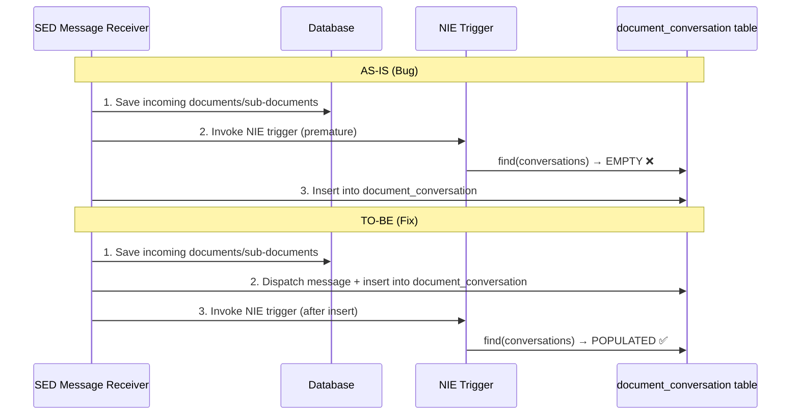

**CIG 9623953142** 

**----- Start of picture text -----** 
JINA2025-Bug_RN11848262 NIE event "Receive_Document" do not have conversations part filled for SEDs U020 04 [th]  August 2025 **----- End of picture text -----** 

ENGINEERING | ENGINEERING D.HUB | CYBERTECH | EY | EUSTEMA 

JINA2025-Bug_RN11848262 

# **TGC Engineering Ingegneria Informatica** 

**JINA2025-Bug_RN11848262** 

**NIE event "Receive_Document" do not have conversations part filled for SEDs U020** 

(CIG 9623953142) 

Date: 04[th] August 2025 

Doc. Version: 1.0 

JINA2025-Bug_RN11848262 

## **Document Control Information** 

> **Didascalia**: Metadati del documento — titolo: JINA2025-Bug_RN11848262, Project Id: CIG 9623953142, Autori: TGC Analyst team, Project Owner: Barbara Ingrosso (PO), PM: Milko Anselmi, Versione 1.0, Riservato, 04 August 2025.

## **Document Approver(s) and Reviewer(s):** 

NOTE: All Approvers are required. Records of each approver must be maintained. All Reviewers 

in the list are considered required unless explicitly listed as Optional. 

|**Name**|**Role**|**Action**|**Date**|
|---|---|---|---|
|||_<Approve / Review>_||
|||_<Approve / Review>_||
|||_<Approve / Review>_||

## **Document history:** 

The Document Author is authorized to make the following types of changes to the document without requiring that the document be re-approved: 

- Editorial, formatting, and spelling 

- Clarification 

To request a change to this document, contact the Document Author or Owner. 

Changes to this document are summarized in the following table in reverse chronological order - (latest version first). 

**Revision Date Created by Short Description of Changes** 

## **Configuration Management: Document Location** 

The latest version of this controlled document is stored in: _link_ 

04-08-2025 _RINA_ Development Environment Architecture 

ENGINEERING | ENGINEERING D.HUB | CYBERTECH | EY | EUSTEMA 

JINA2025-Bug_RN11848262 

## **TABLE OF CONTENTS** 

|**1**|**INTRODUCTION ............................................................................................................ - 3 -**|
|---|---|
|1.1|Purpose of the Document ................................................................................................... - 3 -|
|1.2|Glossary of Terms.................................................................................................................. - 3 -|
|**2**|**ISSUE IDENTIFIED AND RELATED CORRECTIVE ACTIONS ................................................ - 4 -**|
|2.1|Current Situation (AS-IS): ................................................................................................. - 4 -|
|2.2|Corrective Actions (TO-BE) .............................................................................................. - 5 -|
|**3**|**REFERENCES AND RELATED DOCUMENTS ..................................................................... - 6 -**|

## **1 INTRODUCTION** 

## **1.1 Purpose of the Document** 

This document aims to describe the solution undertaken to resolve the "bug" reported in ticket RN:11848262 opened by the Latvia on February 7, 2025. It provides a technical overview of the identified problem, and the changes implemented by TGC for the corrective release. Any change requests (CRs) included in the ticket are not covered by this documentation. 

## **1.2 Glossary of Terms** 

> **Glossario**:
> | Termine/Acronimo | Definizione |
> |---|---|
> | CDM | Common Data Model |
> | CRs | Change requests |
> | JINA | Jump's Implementation of a National Application |
> | NIE | National Information Exchange |
> | SED | Structure Electronic Document |
> | TGC | Temporary grouping of companies |

## **2 ISSUE IDENTIFIED AND RELATED CORRECTIVE ACTIONS** 

On February 7, 2025, an Incident-type ticket (RN:11848262) was opened by the requester Ziedina Inese on behalf of Latvia. 

The reported issue relates to the "Receive_Document" event for SEDs of type U020: it was observed that, upon receipt, the "conversations" section is not being populated. This section is essential for the proper management and traceability of the communication flow between the parties involved in the electronic document exchange (SEDs). The absence of this information compromises the continuity and consistency of the document workflow. 

## **2.1 Current Situation (AS-IS):** 

Following the analysis carried out by the development team regarding ticket RN:11848262, it was identified that the issue was caused by the sequence in which the NIE trigger was invoked during the reception phase of a SED. 

Specifically, the " **conversations** " field was found to be unpopulated because, prior to the modification, the call to the NIE trigger occurred before the actual sending of the SED message. This resulted in a premature data request to the _**"document_conversation"**_ table, which at that point had not yet been populated with the necessary information. 

The _**"document_conversation"**_ table, in fact, was only updated afterwards, at the moment of the actual message transmission. As a result, the "conversations" field appeared empty or incomplete. 

## **AS-IS:** 

- 1) Saving of incoming documents and sub-documents to the database. 

- 2) Invocation of the NIE trigger, which attempted to perform a find operation on the " _**document_conversation**_ " table. 

- 3) Message dispatch and subsequent insert into the " _**document_conversation**_ " table. 

## **2.2 Corrective Actions (TO-BE)** 

The change consists in moving the invocation of the NIE trigger: it is now executed after the SED message has been sent. In this way, at the time the NIE trigger is called, the _document_conversation_ table is already populated, allowing the necessary information to be correctly retrieved for the compilation of the "conversations" field. 

## **TO-BE:** 

- 1) Saving of incoming documents and sub-documents to the database. 

- 2) Message dispatch and data writing to the document_conversation table. 

- 3) Invocation of the NIE trigger, which now performs the find operation after the data has been inserted into " **document_conversation** ", thus retrieving the expected information and correctly populating the "conversations" field. 

## **3 REFERENCES AND RELATED DOCUMENTS** 

|**#**|**Reference or Related Document**||**Source or Link/Location**|
|---|---|---|---|
|1|NIE: UB_BUC_04||_EESSI-9922_|
|||||

ENGINEERING | ENGINEERING D.HUB | CYBERTECH | EY | EUSTEMA 
